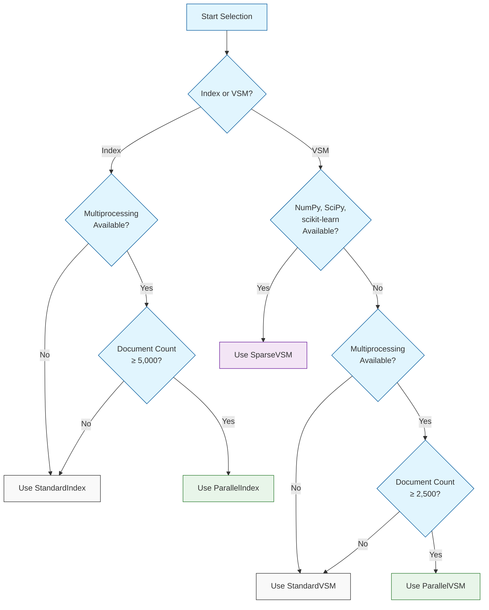

# Document Similarity Analysis System

## Overview

This project implements an optimized and configurable system for analyzing document similarity using Vector Space Models (VSM).

Features include:
- Document indexing with term frequency, inverse document frequency (TF-IDF), and sublinear scaling (Wf-IDF) weighting schemes
- Document similarity calculation using cosine similarity
- Factory pattern for runtime selection of optimal implementations
- Strategy pattern for interchangeable algorithms
- Object-oriented design with abstract base classes
- Performance profiling and reporting utilities
- Parallel processing for large datasets
- Memory-efficient data structures using sparse matrices

## Installation

### Requirements

#### Core Requirements
- Python 3.9+ (Developed and tested with Python 3.13.1)
- NLTK 3.9.1

#### Optional Dependencies (for enhanced performance)
- NumPy (for vector operations)
- SciPy (for sparse matrix representation)
- scikit-learn (for optimized similarity calculations)

Note: Anaconda users should already have NumPy, SciPy, and scikit-learn installed in their environment.

### Setup

1. Create and activate a virtual environment:

```bash
# Create a new virtual environment
python -m venv venv

# Activate the virtual environment
# On Unix/macOS:
source venv/bin/activate
# On Windows:
venv\Scripts\activate
```

2. Install dependencies:

```bash
pip install -r requirements.txt
```

3. Download required NLTK data:

```bash
python -c "import nltk; nltk.download('punkt')"
# This will otherwise be done automatically on first run
```

## Usage

### Basic Usage

Assuming your documents directory, stopwords file, and special characters file are all in the project directory, you can navigate to the project directory and run the system with:

```bash
python main.py
```

### Command Line Options

#### Path and File Options
- `--documents_dir PATH`: Directory containing documents to index (default: "documents")
- `--stopwords_file PATH`: File containing stopwords to remove (default: "stopwords.txt")
- `--special_chars_file PATH`: File containing special characters to remove (default: "special_chars.txt")
- `--index_file PATH`: Path to save/load the index file (default: "index.pkl")
- `--top_k N`: Number of top similar documents to display (If none, user will be prompted)
- `--config PATH`: Path to configuration file (default: "config.json")
- `--use_existing`: Use existing index if available, instead of rebuilding
- `--export_json PATH`: Export index to a JSON file for human-readable inspection
- `--index_mode MODE`: Index implementation to use (choices: "auto", "standard", "parallel", default: "auto")
- `--vsm_mode MODE`: VSM implementation to use (choices: "auto", "standard", "parallel", "sparse", default: "auto")
- `--parallel_index_threshold N`: Document threshold for parallel index (default: 5000)
- `--parallel_vsm_threshold N`: Document threshold for switching to ParallelVSM (default: 2500)
- `--parallelize_weights`: Parallelize weight computation in ParallelVSM (For benchmarking only)
- `--stats`: Display detailed index statistics
- `--check_deps`: Check and display available dependencies

### Examples

Basic usage:
```bash
python main.py --documents_dir "path/to/my/documents" --stopwords_file "path/to/stopwords.txt" --special_chars_file "path/to/special_chars.txt"
```

Force a specific implementation:
```bash
python main.py --vsm_mode parallel --index_mode parallel
```

Check available dependencies before running:
```bash
python main.py --check_deps
```

Export index to JSON for inspection:
```bash
python main.py --use_existing --export_json index_data.json
```

## Project Architecture

The project is designed using a modular, extensible architecture with clear separation of concerns. This design allows different implementations to be swapped in and out based on dataset characteristics and available system resources.

### Architectural Overview

```
document-similarity/
├── main.py                 # Entry point and CLI interface
├── figures/                # Performance analysis figures
│   ├── figure_1.png        # VSM implementation benchmarking
│   └── figure_2.png        # Indexing implementation benchmarking
├── README.md               # Project documentation
├── requirements.txt        # Project dependencies
├── config.json             # Configuration settings (generated on first run)
├── src/
│   ├── profiler.py         # Performance monitoring utilities
│   ├── index/              # Document indexing subsystem
│   │   ├── base.py         # Abstract base class for indexing
│   │   ├── factory.py      # Factory for selecting optimal index implementation
│   │   ├── standard_index.py  # Single-threaded reference implementation
│   │   └── parallel_index.py  # Multi-threaded implementation for large datasets
│   ├── vsm/                # Vector Space Model subsystem
│   │   ├── base_vsm.py     # Abstract base class for VSM implementations
│   │   ├── factory.py      # Factory for selecting optimal VSM implementation
│   │   ├── standard_vsm.py # Sequential implementation for small datasets
│   │   ├── parallel_vsm.py # Parallel implementation for medium-large datasets
│   │   └── sparse_vsm.py   # NumPy/SciPy/scikit-learn implementation for optimal performance
│   └── utils.py            # Utility functions for configuration and statistics
```

### Subsystem Descriptions

#### 1. Main Entry Point

**main.py** serves as the entry point and command-line interface. It parses arguments, reads configuration, and coordinates the indexing and similarity analysis processes. For ease of grading, methods that might otherwise be located in a utiity file are included here if they are specific to the assignment requirements.

#### 2. Profiling System

**src/profiler.py** provides a performance monitoring system with:
- Timing of individual operations using context managers
- Total execution time tracking
- Message logging for diagnostics
- Report generation with detailed breakdowns

#### 3. Document Indexing Subsystem

The indexing subsystem is responsible for processing documents, extracting terms, and building data structures for efficient retrieval.

**src/index/base.py** defines the BaseIndex abstract class with the core interface. Only the StandardIndex implements this interface directly, while the ParallelIndex extends the StandardIndex. While it's not necessary to have a base class with only one concrete implementation, this approach is more extensible to support alternative pre-processing or indexing strategies in the future.

**src/index/factory.py** implements the factory pattern for selecting the appropriate index implementation.

**src/index/standard_index.py** provides a sequential implementation optimized for smaller collections.

**src/index/parallel_index.py** extends StandardIndex with parallelized document processing for larger collections.

#### 4. Vector Space Model Subsystem

The VSM subsystem is responsible for computing document similarities using the vector space model.

**src/vsm/base_vsm.py** defines the BaseVSM abstract class with the core interface. This was an especially useful approach for optimization, allowing me to parallelize different parts of the VSM calculation independently and benchmark the performance of each. The three concrete implementations provided represent the best combination of approaches for each scenario derived from five experimental implementations tested across document collections ranging from 1,000 documents to 30,000 documents.

**src/vsm/factory.py** implements the factory pattern for selecting the appropriate VSM implementation.

**src/vsm/standard_vsm.py** provides a sequential implementation optimized for smaller collections without dependencies.

**src/vsm/parallel_vsm.py** implements a parallel version using multiprocessing for medium to large collections without dependencies.

**src/vsm/sparse_vsm.py** provides the fastest implementation using NumPy, SciPy, and scikit-learn using sparse matrices, vectorized operations, and BLAS optimizations.

#### 5. Utilities

**src/utils.py** provides configuration management and statistical utilities.

### Implementation Selection Logic

The system uses carefully determined thresholds to select the most efficient implementation based on document count, available dependencies, and system resources.

#### Selection Process Flowchart



#### Detailed Selection Criteria

1. **Index Implementation**:
   - If document count < 5,000: StandardIndex
   - If document count ≥ 5,000 and multiprocessing available: ParallelIndex
   - Otherwise: StandardIndex

2. **VSM Implementation**:
   - If NumPy, SciPy, and scikit-learn available: SparseVSM (fastest for all dataset sizes)
   - If document count < 2,500: StandardVSM
   - If document count ≥ 2,500 and multiprocessing available: ParallelVSM
   - Otherwise: StandardVSM

These thresholds were determined through extensive benchmarking to identify the crossover points where parallelization overhead becomes worthwhile. For different hardware or dataset characteristics, these thresholds can be adjusted in the configuration file (generated on first run).

## Performance Analysis

### VSM Implementation Benchmarking

Performance comparison (runtime in seconds):

[Figure 1](figures\figure_1.png)

| Document Count | Standard  | Parallel | Sparse  |
| -------------- | --------- | -------- | ------- |
| 1000 Docs      | 2.8422    | 11.9635  | 1.0132  |
| 2000 Docs      | 9.8976    | 15.1696  | 1.9903  |
| 3000 Docs      | 18.5161   | 19.0588  | 3.0039  |
| 4000 Docs      | 31.8160   | 22.3296  | 4.0728  |
| 5000 Docs      | 48.5661   | 25.7587  | 4.9694  |
| 15000 Docs     | 449.5013  | 101.2593 | 20.9662 |
| 30000 Docs     | 1928.2886 | 368.9252 | 55.8942 |

Parallelization threshold fine-tuning results:

| Fine-Tuning Datasets | Standard | Parallel |
| -------------------- | -------- | -------- |
| 2500 Docs            | 13.6522  | 14.2365  |
| 2600 Docs            | 15.6922  | 14.9760  |

The crossover point where ParallelVSM becomes more efficient than StandardVSM
is around 2500-2600 documents.

### Indexing Implementation Benchmarking

Performance comparison (index building time in seconds):

[Figure 2](figures\figure_2.png)

| Document Count | Standard Index | Parallel Index |
| -------------- | -------------- | -------------- |
| 1000 Docs      | 0.8525         | 3.4042         |
| 2000 Docs      | 1.7143         | 3.5417         |
| 3000 Docs      | 2.5156         | 3.7468         |
| 4000 Docs      | 3.4333         | 3.8841         |
| 5000 Docs      | 4.2605         | 4.1409         |
| 15000 Docs     | 12.4163        | 5.7538         |
| 30000 Docs     | 24.9075        | 8.3567         |

The crossover point where ParallelIndex becomes more efficient than StandardIndex
is around 5000 documents, as shown in the performance data above.

### Performance on Given Dataset

|                  | Standard VSM | Parallel VSM | Sparse VSM |
|------------------|--------------|--------------|------------|
| Sequential Index | 8.2119       | 10.3087      | 2.1644     |
| Parallel Index   | 9.7685       | 12.2265      | 3.8626     |


## Academic Disclaimer

This project was developed as part of an academic assignment. All data, methods, and performance analyses are for educational purposes only.
